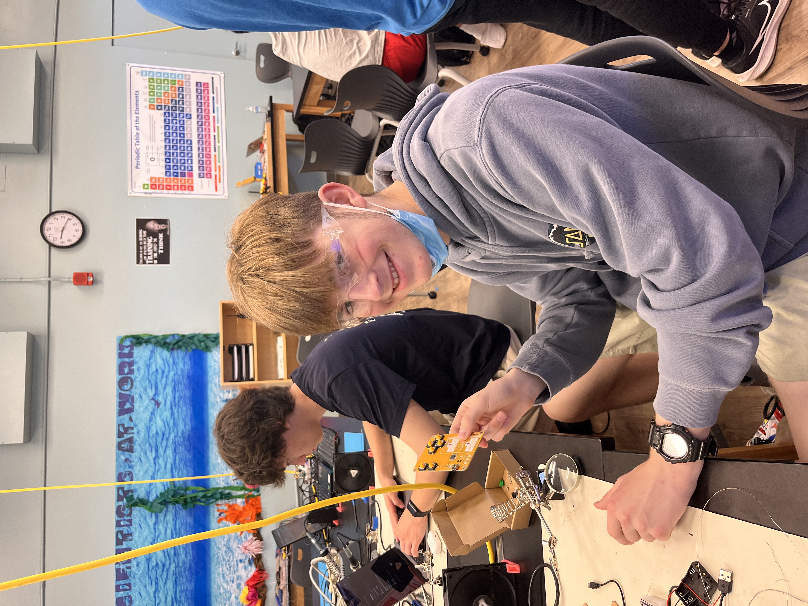

# Custom Object Detection System
A project that can detect objects, using TensorFlow Lite on the Raspberry Pi, adding convienence to your building experience. 

<!---You should comment out all portions of your portfolio that you have not completed yet, as well as any instructions:-->
<!---```HTML -->
<!--- This is an HTML comment in Markdown -->
<!--- Anything between these symbols will not render on the published site -->
<!---```-->

| **Engineer** | **School** | **Area of Interest** | **Grade** |
|:--:|:--:|:--:|:--:|
| Alex N. | Fremont | Mechanical Engineering | Incoming Junior




  
# Final Milestone


<iframe width="560" height="315" src="https://www.youtube.com/embed/EV1cqBGiJh8?si=Ei2IFFhwSxzjn1fA" title="YouTube video player" frameborder="0" allow="accelerometer; autoplay; clipboard-write; encrypted-media; gyroscope; picture-in-picture; web-share" referrerpolicy="strict-origin-when-cross-origin" allowfullscreen></iframe>

In my third and final milestone, I developed an object detection software using TensorFlow Lite, enabling real-time object detection on the Raspberry Pi. Leveraging Google's TensorFlow GitHub library, I utilized their optimized computer vision model to achieve swift and efficient object detection and computer vision capabilities on the Raspberry Pi.
- I was able to install a couple of python packages, and RPI vision. I then cloned a github repository and it had a data file that it trained a model that could detect objects. After installing tensorflow and running the command to start the object detection, it started working.
- One of the biggest challenges with this final milestone was trying to run the command that would start the detection software. The terminal would say that it’s missing a module, I would install that module using a PIP command and it would say it’s missing a different module. For me to get it to work, I had to set up the virtual environment so all of my packages were in one place.
<!---
- A summary of key topics you learned about
- What you hope to learn in the future after everything you've learned at BSE-->


# Second Milestone

<iframe width="560" height="315" src="https://www.youtube.com/embed/muLqT1Jm2Yo?si=g8nGha933mwRVHtQ" title="YouTube video player" frameborder="0" allow="accelerometer; autoplay; clipboard-write; encrypted-media; gyroscope; picture-in-picture; web-share" referrerpolicy="strict-origin-when-cross-origin" allowfullscreen></iframe>

Since my previous milestone, I have worked on setting up and testing the camera module and the Adafruit Braincraft HAT for my TensorFlow Lite Object Detection project. 
- Properly connected and configured the Raspberry Pi Camera Module 3 to ensure it captures images correctly. Integrated the Adafruit Braincraft HAT to display the terminal output of the Raspberry Pi.
- I encountered challenges in implementing the video feed from the camera to the Adafruit Braincraft HAT. As a solution, I utilized the main monitor on my computer, which ultimately was beneficial due to its better resolution.
- Moving ahead, my focus will be on installing TensorFlow 2 and RPI Vision libraries on the Raspberry Pi, followed by testing the object detection capabilities.

  
# First Milestone

<iframe width="560" height="315" src="https://www.youtube.com/embed/p8tFRpc52To?si=-ktnJg8QgnNMPHI5" title="YouTube video player" frameborder="0" allow="accelerometer; autoplay; clipboard-write; encrypted-media; gyroscope; picture-in-picture; web-share" referrerpolicy="strict-origin-when-cross-origin" allowfullscreen></iframe>

My project is Raspberry Pi object detection through machine learning. My first milestone involved building the hardware. The camera module will take a picture and run it through the tensorflow lite python interpreter and that will return what it thinks it sees:
- Materials: Computer, Raspberry Pi 4 (64 bit), Web Cam, Adafruit Braincraft HAT.
- While building my hardware I accidentally touched the input and output pins which caused the raspberry pi to short circuit and I had to wait for claudia to order a new Raspberry pi, which made building the hardware a little difficult. 
- Going further, I plan to start work on the first camera test, and getting the display to show what the camera is seeing. 

# Schematics 

Here's where you'll put images of your schematics. [Tinkercad](https://www.tinkercad.com/blog/official-guide-to-tinkercad-circuits) and [Fritzing](https://fritzing.org/learning/) are both great resoruces to create professional schematic diagrams, though BSE recommends Tinkercad becuase it can be done easily and for free in the browser. 

<!---# Code
Here's where you'll put your code. The syntax below places it into a block of code. Follow the guide [here]([url](https://www.markdownguide.org/extended-syntax/)) to learn how to customize it to your project needs.-->

<!---```c++
void setup() {
  // put your setup code here, to run once:
  Serial.begin(9600);
  Serial.println("Hello World!");
}

void loop() {
  // put your main code here, to run repeatedly:

}
```

# Bill of Materials
Here's where you'll list the parts in your project. To add more rows, just copy and paste the example rows below.
Don't forget to place the link of where to buy each component inside the quotation marks in the corresponding row after href =. Follow the guide [here]([url](https://www.markdownguide.org/extended-syntax/)) to learn how to customize this to your project needs. 

| **Part** | **Note** | **Price** | **Link** |
|:--:|:--:|:--:|:--:|
| Item Name | What the item is used for | $Price | <a href="https://www.amazon.com/Arduino-A000066-ARDUINO-UNO-R3/dp/B008GRTSV6/"> Link </a> |
| Item Name | What the item is used for | $Price | <a href="https://www.amazon.com/Arduino-A000066-ARDUINO-UNO-R3/dp/B008GRTSV6/"> Link </a> |
| Item Name | What the item is used for | $Price | <a href="https://www.amazon.com/Arduino-A000066-ARDUINO-UNO-R3/dp/B008GRTSV6/"> Link </a> |

# Other Resources/Examples
One of the best parts about Github is that you can view how other people set up their own work. Here are some past BSE portfolios that are awesome examples. You can view how they set up their portfolio, and you can view their index.md files to understand how they implemented different portfolio components.
- [Example 1](https://trashytuber.github.io/YimingJiaBlueStamp/)
- [Example 2](https://sviatil0.github.io/Sviatoslav_BSE/)
- [Example 3](https://arneshkumar.github.io/arneshbluestamp/)

To watch the BSE tutorial on how to create a portfolio, click here.-->

# Starter Project 

<iframe width="560" height="315" src="https://www.youtube.com/embed/dIFbhf59PQw?si=9BH6f1EvKj84Bn3K" title="YouTube video player" frameborder="0" allow="accelerometer; autoplay; clipboard-write; encrypted-media; gyroscope; picture-in-picture; web-share" referrerpolicy="strict-origin-when-cross-origin" allowfullscreen></iframe>


This is a retro game arcade, you can play SNES tetris with the up, down, left, right buttons and rotational knob, it has a screen to display the score and the blocks alongside a START and STOP button.
- Put simply, all of the input buttons and controls that the player can use will be sent to the micro controller chip in the center and will output movement on the LED display, sound in the peizo buzzer, and the score seen on the top right.
- Something that was particularly challenging was nailing down the soldering, putting the right amount soldering wire on the circuit and lining it up just straight was hard for me. 
- I have made technical advances in understanding how soldering plays a role into assembly of circuits and projects.
